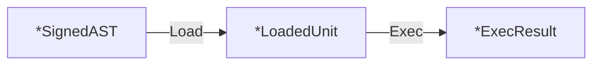

o3:

### Where the **`ns/api`** package stands (my stitched-together memory)

| Area                                              | What we already specced (or partly coded)                                                                                                                                                                                | Open threads / TODO                                                                                                                             |
| ------------------------------------------------- | ------------------------------------------------------------------------------------------------------------------------------------------------------------------------------------------------------------------------ | ----------------------------------------------------------------------------------------------------------------------------------------------- |
| **1. Canonical-AST handling**                     | *`Canonicalise()`* → varint-packed blob + BLAKE3 hash.<br>*`SignedAST{ Blob, Sum, Sig }`* verified with ED25519.                                                                                                         | • Benchmark vs FlatBuffers.<br>• Plug into gateway signing micro-service.                                                                       |
| **2. Run-mode detection**                         | *`DetectRunMode(tree) RunMode`* returns **Library**, **Command**, or **EventSink** based on top-level constructs (no mixing rule).                                                                                       | • Add fast path for “no executable nodes” to skip loader work.                                                                                  |
| **3. Loader / Runner API**                        | `go\nfunc LoadAndMaybeExec(ctx, blob) error\n`<br> • Verifies sig → decodes tree.<br> • If **Command**, runs unnamed block immediately.<br> • Otherwise caches AST for later calls/dispatch.                             | • Transparent result cache (hash → outputs).<br>• Gas/timeout hooks when interpreter lands.                                                     |
| **4. Static-analysis registry**                   | `type Pass interface { Name(); Analyse(*Tree) []Diag }`<br> Built-in passes drafted:<br> ‣ Schema/shape validator<br> ‣ Basic type checker<br> ‣ Capability audit<br> ‣ SecretRef whitelist<br> ‣ “no-set-after-command” | • Wire severity gating into Gateway (`reject on err`, `warn on warn`).<br>• Provide CLI: `ns vet file.ast`.                                     |
| **5. Secrets support**                            | Literal syntax `secret("scope/key", enc="age")` → AST node `SecretRef`.<br>Go helper `secret.Decode()` handles `"none"`, `"age"`, `"sealedbox"`.                                                                         | • Trusted *Preparer* service to fetch from vault, encrypt payload, and emit SignedAST.<br>• New error code `ErrorCodeSecretDecryption` (99909). |
| **6. Error catalogue**                            | Shared `errors.go` with iota-based security block (99901-99908).<br>`ErrorDetails` map + `FormatWithRemediation(err)` helper.                                                                                            | • Add code 99909 for secret decode failure.<br>• Expand remediation texts.                                                                      |
| **7. External execution hooks**                   | Draft interfaces: <br>`go\n type CommandRunner interface { Run(ctx, cmd string, args ...any) error }\n type EventDispatcher interface { Emit(ev string, payload ...any) error; Register(EventHandler) }\n`               | • Flesh out arg encoding (JSON? ND-binary?).<br>• Provide default runner that spawns `ns` CLI for legacy tools.                                 |
| **8. Package layout (agreed but not pushed)**     | \`\`\`                                                                                                                                                                                                                   |                                                                                                                                                 |
| /api                                              |                                                                                                                                                                                                                          |                                                                                                                                                 |
| /loader      (LoadAndMaybeExec, DetectRunMode)    |                                                                                                                                                                                                                          |                                                                                                                                                 |
| /types       (AST, SignedAST, RunMode, SecretRef) |                                                                                                                                                                                                                          |                                                                                                                                                 |
| /analysis    (Pass registry + built-ins)          |                                                                                                                                                                                                                          |                                                                                                                                                 |
| /secret      (Decode helpers)                     |                                                                                                                                                                                                                          |                                                                                                                                                 |
| /errors      (shared catalogue)                   |                                                                                                                                                                                                                          |                                                                                                                                                 |
| \`\`\`                                            | • Write go\:generate directives for mock AST fixtures.<br>• Decide whether /analysis gets separate `go.mod` for plugin loading.                                                                                          |                                                                                                                                                 |

---

#### Immediate next shippable chunk

1. **Push `/api/loader` with stub interpreter call** (returns “not implemented” for now).
2. **Bundle the first three analyser passes** so gateway can start vetting blobs.
3. **Ship `secret.Decode` with `enc="none"` only** to prove the flow; add `age` after.

That would let FDM:

> *“Upload SignedAST → gateway verifies → static vet passes → if type=Command run once.”*

From there we iterate on interpreter integration, caching and richer secret handling.

Let me know which slice you want carved out first (code skeleton, tests, or docs), and I’ll draft it.


AJP: I'd like to nail down the form and fit of the API before we trouble with encoding or the more advanced things. I want to make sure ns is easy to integrate first; and the api should have both script and ast doorways, so we need things to parse script to ast and fmt to get back (this may mean adding comments etc. to the ast). Could you lay out a nice usable API grammar for us? Including the things you mentioned above?


o3: 
Below is a **single-screen blueprint** for an **“easy-to-integrate”** NeuroScript API.
Everything is expressed as Go types + interfaces; import paths are indicative.

```text
yourrepo/
├── api                 ← public façade (no deps on interpreter internals)
│   ├── parse.go        (Script ⇆ AST doorway)
│   ├── fmt.go          (AST ⇆ Script doorway)
│   ├── ast.go          (common tree types; comment + source-span support)
│   ├── canon.go        (canonicalise + hash helpers)
│   ├── sign.go         (Sign/Verify SignedAST blobs)
│   ├── loader.go       (LoadAndMaybeExec + run-mode detection)
│   ├── analysis/
│   │   ├── pass.go     (Pass registry + Diag types)
│   │   └── builtin.go  (shape, typecheck, capability, secret passes)
│   ├── secret/         (Decode helpers; no vault coupling)
│   └── errors.go       (error catalogue + remediation map)
└── internal/…          (interpreter, vault client, etc.)
```

---

## 1 AST fundamentals (`api/ast.go`)

```go
package api

// Position = 1-based line/col in original source.
type Position struct{ Line, Col int }

// Node is the root interface for all AST nodes.
type Node interface {
    Pos() Position
    End() Position
    Kind() Kind
}

// Kind is a stable enum; NEVER reorder (hash depends on it).
type Kind uint8

const (
    KindFile Kind = iota
    KindCommandBlock
    KindFuncDecl
    KindEventHandler
    KindSetStmt
    KindExpr
    KindComment             // preserved round-trip
    KindSecretRef           // literal secret("scope/key", enc="age")
    // … more …
)

// Tree wraps the root node and a comment table for fmt round-trip.
type Tree struct {
    Root     Node
    Comments []Comment
}

type Comment struct {
    Pos  Position
    Text string // original // or /* */ text
}
```

*Why keep comments?* `api/fmt.go` can perfectly reproduce the original file (or a prettified one) — crucial for human diff reviews.

---

## 2 Script ⇆ AST doorways

```go
// parse.go
package api

type ParseMode uint8
const (
    ParsePreserveComments ParseMode = 1 << iota
    ParseSkipComments
)

func Parse(src []byte, mode ParseMode) (*Tree, error)
```

```go
// fmt.go
func Format(tree *Tree, pretty bool) ([]byte, error)
```

*Round-trip guarantee:* `Format(Parse(x)) == x` when `pretty==false`.

---

## 3 Canonicalise, hash & sign

```go
// canon.go
func Canonicalise(tree *Tree) (blob []byte, sum [32]byte)        // varint-packed
func Decode(blob []byte) (*Tree, [32]byte, error)                // verify shape only
```

```go
// sign.go
type SignedAST struct {
    Blob []byte    // canonical bytes
    Sum  [32]byte  // BLAKE3 of Blob
    Sig  []byte    // Ed25519
}

func Sign(priv ed25519.PrivateKey, blob []byte, sum [32]byte) (*SignedAST, error)
func Verify(pub ed25519.PublicKey, ast *SignedAST) (*Tree, error)
```

---

## 4 Run-time loader

```go
// loader.go
type RunMode uint8
const (
    RunModeLibrary RunMode = iota // funcs only
    RunModeCommand                // unnamed command block, run-once
    RunModeEventSink              // one or more on-event handlers
)

func DetectRunMode(tree *Tree) RunMode

// LoaderConfig toggles caching, gas limits, secret decode key, etc.
type LoaderConfig struct {
    Cache         Cache            // optional content-addressed cache
    MaxGas        uint64           // 0 = no limit
    SecretPrivKey []byte           // for secret("…", enc="age")
}

type ExecResult struct {
    Outputs any            // optional run value
    Logs    []string       // or richer slog handler
}

func LoadAndMaybeExec(ctx context.Context, ast *SignedAST,
                      cfg LoaderConfig) (*ExecResult, error)
```

`LoadAndMaybeExec` workflow:

1. **Verify** signature → decode → static-vet.
2. **DetectRunMode**; if `RunModeCommand`, run immediately.
3. For non-command blobs just cache the tree (future `func` calls / event dispatch).

---

## 5 Static-analysis plug-ins

```go
// analysis/pass.go
type Severity uint8
const (
    SevInfo Severity = iota
    SevWarn
    SevError
)

type Diag struct {
    Pos      Position
    Severity Severity
    Pass     string
    Message  string
}

type Pass interface {
    Name() string
    Analyse(tree *Tree) []Diag
}

func RegisterPass(p Pass)
func Vet(tree *Tree) []Diag  // runs all registered passes
```

Built-ins (in `analysis/builtin.go`):

* `shapeValidator`   (schema / Kind sanity)
* `basicTypeCheck`
* `capabilityAudit`   (tool usage)
* `secretWhitelist`   (no secret outside command)
* `setOrder`   (“no set after command{”)

---

## 6 Secret helper (plain, age, sealedbox)

```go
// secret/secret.go
type Ref struct {
    Path string // "prod/db/main"
    Enc  string // "none"|"age"|"sealedbox"
    Raw  []byte // encoded payload
}

func Decode(ref Ref, privKey []byte) (string, error)
```

The parser turns `secret("prod/db/main", enc="age")`
into `*ast.SecretRef` with nil `Raw`.
The **Preparer** service populates `Raw` before signing.

---

## 7 Error catalogue (excerpt)

```go
type ErrorCode int

const (
    ErrorCodeGeneric ErrorCode = 0
    // … normal errors …
    // --- security block (iota from 99901) ---
    ErrorCodeAttackPossible ErrorCode = 99901 + iota
    ErrorCodeAttackProbable
    ErrorCodeAttackCertain
    ErrorCodeSubsystemCompromised
    ErrorCodeSubsystemQuarantined
    ErrorCodeEscapePossible
    ErrorCodeEscapeProbable
    ErrorCodeEscapeCertain
    ErrorCodeSecretDecryption // 99909
)

type ErrorDetails struct {
    Code        ErrorCode
    Summary     string
    Remediation string
    Severity    Severity
}

func Lookup(code ErrorCode) (ErrorDetails, bool)
func FormatWithRemediation(err error) string
```

---

## 8 Minimal integration example

```go
// app/main.go
blob := fetchFromGateway()                // SignedAST
tree, err := api.Verify(pubKey, blob)
if err != nil { log.Fatalf("sig fail: %v", err) }

if diags := api.Vet(tree); hasSevError(diags) {
    log.Fatalf("static-vet failed:\n%v", diags)
}

res, err := api.LoadAndMaybeExec(ctx, blob,
    api.LoaderConfig{SecretPrivKey: hostKey})
if err != nil { log.Fatalf("run failed: %v", err) }
fmt.Println("outputs:", res.Outputs)
```

---

### Ready to ratify?

If this grammar looks right, the next step is to push **`api/ast.go`** + **`parse.go`** skeletons so Gemini can start wiring the lexer/parser while you and I draft the first analyser passes.  Just say the word.

----------------

AJP: Just to keep the distinction blindingly obvious, I split the load and exec calls thus:


func Load(ctx context.Context, ast *SignedAST,
	cfg LoaderConfig) (*ExecResult, error)


func Exec(ctx context.Context, ast *SignedAST,
	cfg LoaderConfig) (*ExecResult, error)

Each should only accept the appropriate types or error out immediately.

Things like Position we have in AST I think, should they have their own aliased types in API so externals only have to import the API package?

----------------------


### 1 Make the “no-surprises” wall compile-time hard

Instead of letting **both** entry points accept `*SignedAST`, give each one a *distinct* parameter type.
That way the compiler, not a runtime `if`, bars the wrong call sequence.

```go
// api/sign.go  (unchanged)
type SignedAST struct {
    Blob []byte
    Sum  [32]byte
    Sig  []byte
}

// api/load.go
type LoadedUnit struct {            // ← result of Load
    Tree     *Tree                  // verified & vetted
    Hash     [32]byte               // same as SignedAST.Sum
    Mode     RunMode                // Library | Command | EventSink
    RawBytes []byte                 // canonical bytes (for cache)
}

// Only transforms/validates – it **never runs** the code.
func Load(ctx context.Context, s *SignedAST,
          cfg LoaderConfig) (*LoadedUnit, error)
```

```go
// api/exec.go
type ExecConfig struct {
    Cache         Cache      // may be nil
    SecretPrivKey []byte     // for secret("…")
    MaxGas        uint64
}

// Exec refuses anything except a **LoadedUnit**
func Exec(ctx context.Context, lu *LoadedUnit,
         cfg ExecConfig) (*ExecResult, error)
```

*Compile-time guard:* if a caller tries `Exec(ctx, signedAST, …)` it simply won’t build.

---

### 2 Loader / Exec pipeline in one glance



1. **Load**

   * Verify signature → parse/canonical compare
   * Run static-vet passes
   * Return `LoadedUnit` (cacheable, immutable)
2. **Exec**

   * Optionally short-circuit via cache
   * If `lu.Mode == RunModeCommand` run immediately
   * Else register funcs / event handlers for later use

---

### 3 API-wide re-export of shared structs

> *“Should externals only import `api`, not `api/ast`?”*
> Yes—re-export the common lightweights so downstream code needs just one `import`.

```go
// api/reexport.go
package api

import "yourrepo/api/ast"

type (
    Position = ast.Position   // type alias, zero overhead
    Kind     = ast.Kind
    Node     = ast.Node
    Tree     = ast.Tree
)
```

*Benefits*:

* callers write `api.Position{Line:1,Col:5}`;
* the AST package remains factored;
* no extra dependencies leak out.

---

### 4 Minimal integration snippet (after the refactor)

```go
sa   := fetchBlob()                      // *SignedAST
lu, _ := api.Load(ctx, sa, api.LoaderConfig{ /* vet opts */ })

res, _ := api.Exec(ctx, lu, api.ExecConfig{
    SecretPrivKey: hostKey,
    MaxGas:        10_000,
})

log.Printf("command outputs: %+v", res.Outputs)
```

The **loader** guarantees the artefact is sane; the **executor** deals only with code that’s already been vetted, so its trust assumptions are smaller.

---

### 5 Next steps I’d code

1. **`api/load.go`**: implement hash-check, signature verify, and the three built-in analysis passes (shape, type-check, “no-set-after-command”).
2. **`api/exec.go`**: stub that rejects `lu.Mode != RunModeCommand` until the interpreter is wired.
3. **`api/reexport.go`**: add the type aliases shown above.

Let me know if this shape looks good; I can whip up the `LoadedUnit` and loader skeleton next.


AJP: Actually, I need to make sure our internal ducks are in a row first. Could you write a quick description for Gemini on what they need to make sure is in place for the API package to talk to the lang/ast/parser/interpreter pipeline properly. Gemini will have to pull this together across 406 files. I'm thinking comments, what the tree type should look like etc. We'll likely have to make some tweaks.

## “Integration-readiness” checklist for the **`ns/api` ↔ `lang/*`** pipeline

*(One page for Gemini to pin to the monitor while stitching 400-odd files together)*

---

### 1 AST contract (single source of truth)

| Must-have                                                                 | Notes                                                                                      |
| ------------------------------------------------------------------------- | ------------------------------------------------------------------------------------------ |
| **`type Position struct{ Line, Col int }`**                               | 1-based, immutable. `String()` → `"file.ns:12:7"` (needed by `api.FormatWithRemediation`). |
| **`type Kind uint8`** stable enum                                         | Do **not** reorder once published. Add new kinds at the end only.                          |
| **`type Node interface { Pos() Position; End() Position; Kind() Kind }`** | Every concrete node lives in `lang/ast/*`.                                                 |
| **`type Tree struct { Root Node; Comments []Comment }`**                  | Comments captured as their own nodes **or** in the slice; round-trippable.                 |
| **Unnamed `command` block** maps to **`*ast.CommandBlock`**               | One per file; detector logic relies on `KindCommandBlock`.                                 |
| **`*ast.SecretRef` node**                                                 | Fields: `Path string`, `Enc string`, `Raw []byte` (may be nil pre-prepare).                |

> *Public location:* `lang/ast/ast.go`.
> *The `api` package **aliases** these types; keep packages import-cycle-free.*

---

### 2 Parser guarantees (`lang/parser`)

* `Parse(src []byte, preserveComments bool) (*ast.Tree, error)`

  * `preserveComments=false` may drop comments for speed.
* On success the tree **obeys** invariants:

  * Single `CommandBlock` **xor** ≥0 `FuncDecl` **xor** ≥0 `EventHandler`.
  * All child pointers non-nil, positions increasing.
* Returns `ErrSyntax` on first violation; caller wraps into `RuntimeError`.

### 3 Canonicaliser (`lang/canon`)

| Function                                           | Contract                                                                |
| -------------------------------------------------- | ----------------------------------------------------------------------- |
| `Canonicalise(tree *ast.Tree) ([]byte, [32]byte)`  | Deterministic varint encoding; same input → same bytes on any platform. |
| `Decode(blob []byte) (*ast.Tree, [32]byte, error)` | Shape validation only (no signature check).                             |

*Hash = **BLAKE3\_256** of canonical bytes. 32 bytes in `[32]byte`.*

### 4 Signature helpers (`lang/sign`)

```go
type SignedAST struct{ Blob []byte; Sum [32]byte; Sig []byte }

Sign(priv ed25519.PrivateKey, blob []byte, sum [32]byte) (*SignedAST, error)
Verify(pub ed25519.PublicKey, s *SignedAST) (*ast.Tree, error)
```

*`Verify` must re-canonicalise → compare `Sum` → verify `Sig`.*

### 5 Interpreter shim (`lang/interp`)

```go
func ExecCommand(ctx context.Context, tree *ast.Tree,
                 cfg interp.Config) (*api.ExecResult, error)
```

\*Assumes tree has been vetted & is `RunModeCommand`.
*`interp.Config` includes `SecretResolver func(ref *ast.SecretRef) (string, error)`.*

### 6 Static-analysis pass hooks (`lang/analysis`)

Expose registry:

```go
type Pass interface{ Name() string; Analyse(*ast.Tree) []api.Diag }
func RegisterPass(p Pass)
```

Built-ins already drafted (shape, typecheck, capability, secret, set-order).

### 7 Error codes (`lang/errors`)

* Ensure the **99901-99909** block exactly matches the catalogue given last (add `ErrorCodeSecretDecryption`).
* `FormatWithRemediation` remains in `api`, but needs `errors.Lookup` underneath.

### 8 Secrets decoding stub (`lang/secret/decoder.go`)

Provide:

```go
func Decode(ref *ast.SecretRef, priv []byte) (string, error) // enc = "none"|"age"|"sealedbox"
```

Return `ErrSecretUnsupported` if `Enc` unknown; interpreter lifts to 99909.

### 9 Package hygiene

* `lang/*` **must not** import `api` (avoid cycles).
* `api/reexport.go` should say:

```go
type Position = ast.Position
type Kind     = ast.Kind
type Node     = ast.Node
type Tree     = ast.Tree
```

*That way external consumers do `import "yourrepo/api"` only.*

### 10 Smoke test to keep green

```
go test ./api -run TestEndToEnd
```

Flow:

1. Read `testdata/template.ns`
2. Parser → Tree
3. Canonicalise → Sign (dummy key)
4. Load → Vet passes
5. Exec → get `"hello world"` output

---

### TL;DR for Gemini

1. **Stabilise AST structs & kinds** — parser, canoniser, interpreter all speak that.
2. **Wire canonicaliser + signer** — deterministic bytes, BLAKE3, Ed25519.
3. **Expose ExecCommand(tree)** — run only verified, vetted command trees.
4. **Keep comments & Position in AST** — for `api.Format` and diagnostics.

Once those surfaces compile, `api` can lock onto them and external integrators need nothing beyond `import "yourrepo/api"`.
